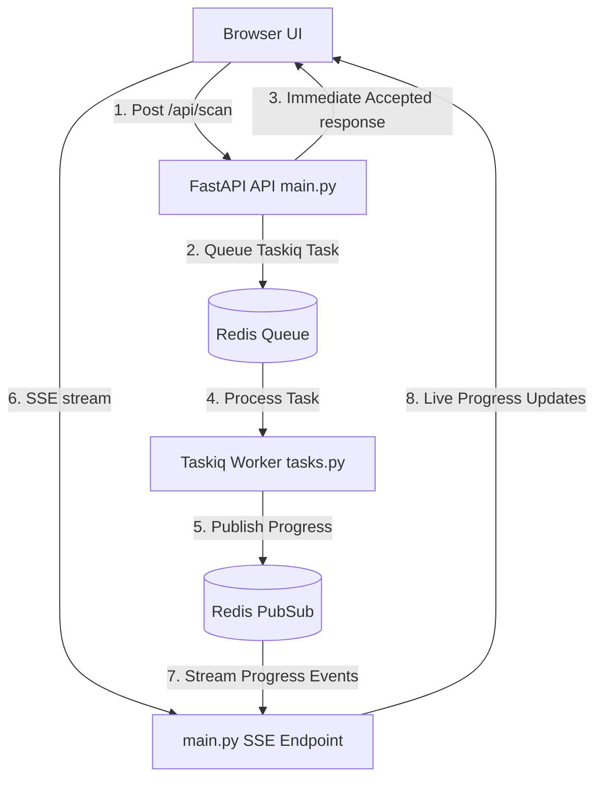

# Vultix Project Optimization Report
An in-depth technical analysis of the architectural, concurrent, and computational optimizations implemented in the Vultix Enterprise-Grade Vulnerability Scanner.

---

## 1. Architectural Evolution: Flask Monolith to Async FastAPI

The core application was migrated from a synchronous, blocking Flask monolith (`app.py`) to an asynchronous ASGI application powered by FastAPI and Uvicorn (`main.py`). This shift fundamentally resolves concurrency bottlenecks during heavy web-scanning workflows.

### Key Upgrades
* **ASGI & Uvicorn Engine:** Switched from a synchronous WSGI Flask development server to high-performance Uvicorn (ASGI), enabling thousands of concurrent HTTP connections with extremely low overhead.
* **Fully Asynchronous Route Handlers:** All endpoint functions in [main.py](file:///c:/Web%20Scanner%20-%20Copy/main.py) are defined as `async def`. During network or database wait states, the event loop is instantly released to serve other requests rather than blocking the execution thread.
* **Stateless JWT-Based Authentication:** Naive server-side sessions were replaced with a stateless, lightweight JWT Bearer system (access + refresh tokens). By eliminating server-side session lookup tables, memory footprints are kept minimal, and the API can easily scale horizontally.

---

## 2. Database Optimization: Asynchronous Persistence Layer

Database operations in [scan_db.py](file:///c:/Web%20Scanner%20-%20Copy/models/scan_db.py) were rewritten from the ground up to prevent the SQL database disk operations from blocking the web event loop.

### Key Upgrades
* **Non-Blocking I/O (`aiosqlite`):** All database functions are fully async, utilizing `aiosqlite` for database connection context managers. 
* **Safe Runtime Schema Migrations:** A custom runtime schema verification system was added to handle existing databases. During startup, the engine queries table metadata (`PRAGMA table_info`) and dynamically adds missing columns like `user_id` without corrupting historical scan data.
* **Cascading Deletions:** Relational structures are optimized using SQLite `FOREIGN KEY` cascades (`ON DELETE CASCADE`). Deleting a single scan row in `scans` automatically cleans up all associated vulnerability rows in `vulnerabilities` in a single atomic transaction.

---

## 3. Background Processing & Real-Time SSE Pipeline

To avoid crashing the API server during intensive security checks, the background execution model was completely decoupled.

### Key Upgrades
* **Taskiq Task Offloading:** Traditional thread spawns (`threading.Thread`) were replaced with a production-grade background worker architecture using **Taskiq** and **Redis** as a distributed message broker.
* **Server-Sent Events (SSE) Streaming:** Instead of hammering the database with continuous client-side HTTP polling to check progress, the backend utilizes `sse-starlette` to stream progress payloads directly to the browser.
* **Redis Pub/Sub & Caching Integration:**
  - Progress updates are published by the background worker into a Redis Pub/Sub channel (`scan:<scan_id>`), which the SSE endpoint listens to and forwards instantly to the client.
  - The latest progress snapshot is cached in Redis (`scan:progress:<scan_id>`) for 2 hours. This prevents the UI progress bar from resetting to 0% if the user navigates away or refreshes the page.
* **Non-Blocking Cancellation System:** FastAPI publishes a "cancel" token to the Redis channel `scan:cancel:<scan_id>`. The worker monitors this channel inside an asynchronous background watcher (`_watch_cancel`), immediately triggering a safe teardown at the next checkpoint, saving partial results, and marking the scan as `cancelled`.

---

## 4. Web Crawler Optimizations

The web crawler in [crawler.py](file:///c:/Web%20Scanner%20-%20Copy/scanner/crawler.py) was completely optimized to achieve high crawler velocity while maintaining an extremely safe system footprint.

### Key Upgrades

| Optimization Feature | Sync Implementation (Old) | Async Implementation (New) | Impact |
| :--- | :--- | :--- | :--- |
| **HTTP Request Engine** | Blocking `requests.get` | Asynchronous `aiohttp` | Prevents connection bottlenecks, vastly increasing spider speed. |
| **Content Verification** | Fetched full HTML body first | Fast `HEAD` request first | Inspects `Content-Type` headers first. Skips non-HTML files (images, zip files, PDFs) without downloading their bodies, saving massive bandwidth and memory. |
| **Connection Timeout** | 10 seconds | 3 seconds | Fast-fails on slow or dead endpoints, avoiding worker hanging. |
| **Concurrency Control** | Serial execution | `asyncio.Semaphore(max=5)` | Restricts parallel worker requests to prevent overloading target websites. |
| **Memory Preservation** | Unlimited body size | Cap at 1 MB (`MAX_RESPONSE_SIZE`) | Skips massive files to ensure system RAM is never bloated during scraping. |
| **Evasion & Backoff** | Immediate retry / crashes | Exponential Backoff (2 retries) | Gracefully recovers from brief network fluctuations or rate limit spikes. |

---

## 5. Intelligent AI Scanner & vLLM Orchestration

The AI pipeline inside [ai_orchestrator.py](file:///c:/Web%20Scanner%20-%20Copy/scanner/ai_orchestrator.py) represents the highest tier of engineering optimization, squeezing maximum throughput out of limited GPU VRAM budgets (e.g., RTX 4050 6GB).

### Key Upgrades
* **vLLM Transition & OpenAI Client Interface:** Removed the slow, synchronous `ollama` package, replacing it with `openai.AsyncOpenAI` pointed to a high-speed **vLLM** server.
* **Dynamic LoRA Injection (Zero Cold-Starts):** Rather than performing expensive base model reloads (~minutes) when switching AI roles, the base model (e.g. Llama-3) is kept hot in VRAM. Dynamic LoRA adapters (Analyst, Executor) are loaded on-the-fly via the `model` query parameter, shifting roles in milliseconds.
* **Pre-emptive WAF Evasion:**
  - Before launching any scanner, an async WAF detection probe (`detect_waf`) inspects HTTP headers and response snippets for CDN or firewall signatures (e.g., Cloudflare, Akamai, Sucuri).
  - If a WAF is detected, the AI agents are warned immediately, prompting them to deploy evasion techniques (double URL encoding, browser header rotation, payload fragmentation) on **Attempt 1** instead of getting blocked and blacklisted on a naive first attempt.
* **Adaptive AI Semaphore:** Queries the vLLM health endpoint at runtime. If fully responsive, it increases concurrency to `Semaphore(3)` to maximize local hardware pipelines; if struggling or slow, it drops to a conservative `Semaphore(2)`.
* **VRAM-Safe Input Sanitizer:** A clean parser (`_clean_executor_output`) dynamically strips HTML noise (embedded CSS, JS, SVG blobs, meta tags) and truncates HTML logs to a VRAM-safe length of 1,200 characters before passing outputs to the AI Analyst, keeping context windows high-signal and within optimal bounds.
* **Smart Evidence Truncation:** Collapses duplicate findings by target URL and vulnerability type. It appends subsequent duplicate logs into a single record up to a hard cap of 3 instances, adding a clean overflow indicator (e.g., `+ 5 more instances detected`) to keep SQLite row limits and frontend rendering fast.
* **Shared Crawl Cache:** To eliminate redundant operations, crawled structures are saved in memory and passed directly to both the AI orchestrators and the traditional local fallback scanners. Scans never execute a duplicate crawl.
* **Concurrent Baseline Scanners:** The 5 traditional scanners (SQLi, XSS, SSTI, Misconfig, Advanced) are run concurrently via `asyncio.gather()` in thread pools (`asyncio.to_thread()`), pushing findings to SQLite in real-time as each group completes rather than delaying results until the entire suite finishes.

---

## 6. Frontend Architecture & Client-Side Optimizations

The React-based frontend (built with Vite, React Router, TailwindCSS, and custom glassmorphism styling) is engineered for optimal performance, low latency, and real-time visualization of scanning tasks.

### Key Upgrades

### A. Stateless JWT Refresh & API Deduplication
The API client layer in [client.js](file:///c:/frontend/src/api/client.js) is built on top of Axios interceptors to deliver an uninterrupted security dashboard experience:
* **HttpOnly Credentials Integration:** Instantiates `withCredentials: true` globally so secure HttpOnly refresh-token cookies are sent automatically on `/api/auth/refresh` calls, keeping secrets out of local storage.
* **Axios Request Interceptor:** Seamlessly queries `localStorage` and attaches access tokens as `Authorization: Bearer <token>` on all outgoing API calls.
* **Concurrent Refresh Deduplication:** If multiple concurrent dashboard widgets return a `401 Unauthorized` simultaneously when access tokens expire, a singleton promise (`_refreshPromise`) deduplicates refresh requests. Rather than hammering the backend auth database, only one `/api/auth/refresh` request is in-flight.
* **Zero-Interruption Request Replay:** Once a token is refreshed, the failed request is transparently replayed using the new token. The user encounters zero UI flashes or authentication errors.

### B. High-Performance Real-Time SSE Processing
In [ScanProgressPage.jsx](file:///c:/frontend/src/pages/ScanProgressPage.jsx), real-time progress streaming is structured to handle massive, concurrent server updates smoothly:
* **EventSource Query-Param Authentication:** Since the native HTML `EventSource` web standard does not support standard HTTP headers, the client securely routes authorization tokens through the query string (`/api/scan/stream/<id>?token=<token>`).
* **Double Source-of-Truth Loader:** If a scan is already running and the user joins or refreshes the page midway, the page initiates a parallel REST request (`api.get('/api/scan/<id>')`) to load all historic findings, while subscribing to the SSE stream to capture live findings concurrently.
* **Smart Stream Reconnection & Exponential Backoff:** If the SSE stream errors or drops out due to network issues:
  1. The client shuts down the broken stream container.
  2. It performs an immediate silent JWT refresh to re-auth the user.
  3. It executes a reconnect retry with an exponential backoff formula:
     $$\text{Delay} = \min(\text{RETRY\_DELAY\_MS} \times \text{attempts}, 15000)$$
  4. It caps retries at 5 attempts before displaying a warning prompt.
* **Live Severity Processing & Collapsible Trays:** Groups and processes incoming vulnerabilities live by severity metrics, keeping resource rendering lightweight to prevent DOM lagging during fast scan updates.

### C. UI Responsiveness & Optimistic Updates
To keep the dashboard fast and reactive:
* **Optimistic Deletion Feedback:** In [HistoryPage.jsx](file:///c:/frontend/src/pages/HistoryPage.jsx), deleting a scan deletes it locally (`setScans(s => s.filter(...))`) instantly, letting the interface remain interactive while the database deletion executes in the background.
* **Smart Progress Tracking:** Maps active message logs to dynamic attack badges, alerting the user dynamically when CDN/WAF blocks are active or specific scanners are operating.

---

> [!NOTE]
> All optimizations were implemented while preserving backwards compatibility. The DB schema remains fully compatible with historical `vultix.db` files, the crawler includes a synchronous `requests` fallback for environments where `aiohttp` is unavailable, and the frontend handles older browsers gracefully.

> [!TIP]
> To monitor these background worker tasks, you can run the Taskiq CLI or inspect Redis memory stats using `redis-cli info memory`.

