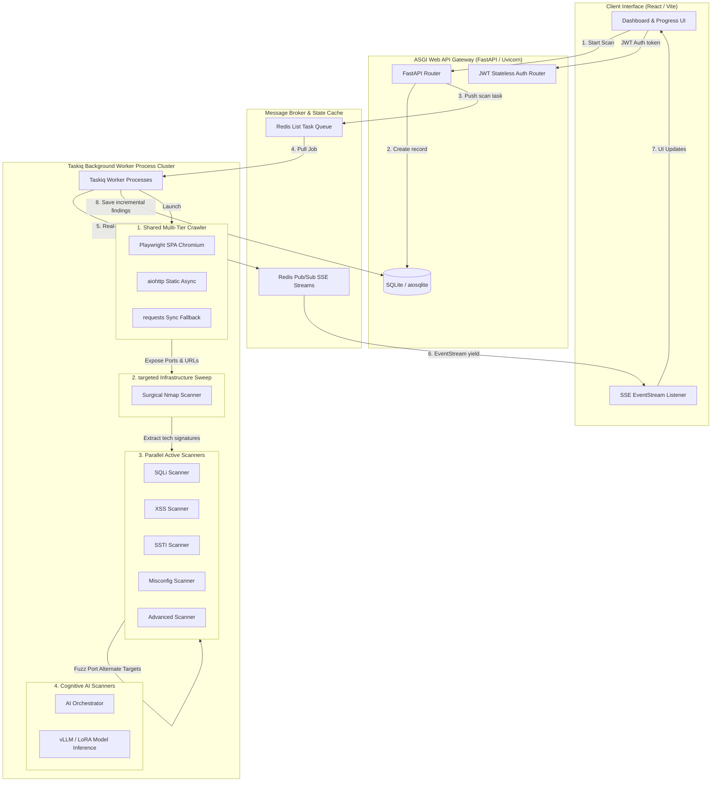

# Vultix Web Vulnerability Scanner
## Enterprise Asynchronous Architecture & Implementation Blueprint

Vultix is an enterprise-grade, high-efficiency asynchronous vulnerability scanner built with a modern Python/FastAPI/React architecture. It replaces legacy threaded synchronous architectures with high-throughput concurrent workers, a state-of-the-art multi-tier crawler, parallel fuzzing scanners, real-time client streaming, and AI-powered orchestration.

---

## 1. Technical Architecture & Block Diagram

Vultix runs on a decentralized three-layer architecture designed for maximum performance, horizontal scalability, and low latency:



---

## 2. Project Improvements & Breakthrough Advancements

Vultix replaces classic, slow, synchronous monolith scanners with several state-of-the-art upgrades:

1.  **Distributed Taskiq Engine:** Replaces dangerous, memory-leaking background threads (`threading.Thread`) with out-of-process distributed worker queues managed by **Redis** and **Taskiq**, allowing linear scaling of workers across multiple nodes.
2.  **Stateless JWT Authentication:** Fully replaces traditional stateful server sessions with cryptography-signed stateless HTTP Bearer JSON Web Tokens (JWT) for high security and easy load balancing.
3.  **Real-Time Server-Sent Events (SSE):** Replaces expensive backend HTTP polling cycles with highly efficient, low-overhead SSE streams via **Redis Pub/Sub**, ensuring real-time progress bar movements and immediate live vulnerability reporting.
4.  **Stealthy Opportunistic Port Discovery:** Gathers active non-standard ports passively during static and Playwright crawling phases. This eliminates high-noise port sweeps and prevents WAF/IDS detection.
5.  **Context-Aware Active Fuzzing & Tech Prioritization:** Integrates Nmap's banner and service fingerprints directly with the SSTI and vulnerability testing suites, dynamic-sorting payloads to prioritize the server's specific operating framework.
6.  **Adaptive AI-Powered Scanning Orchestration:** Automatically measures the local **vLLM** inference server capacity, dynamically scaling concurrency, detecting WAF controls (such as Cloudflare headers), and applying advanced payload evasion techniques from the very first scan attempt.

---

## 3. Step-by-Step Execution Workflow

```
[UI Trigger] ──> [FastAPI Queue Engine] ──> [Taskiq Worker Pipeline Start]
                                                      │
                                                      ▼
[AI / Baseline Engine Phase 3] <── [Targeted Nmap] <── [Passive Port Crawler Phase 1]
              │
              ▼
[Delta-DB Incremental Save] ──> [Redis Pub/Sub] ──> [SSE Live Browser Stream]
```

1.  **Scan Initialization:** The client issues a signed HTTP POST request to `/api/scan`. FastAPI validates the URL, inserts a pending record into the SQLite database via `aiosqlite`, pushes the job to the Redis queue, and immediately returns a `202 Accepted` response.
2.  **Client SSE Connection:** The browser connects to the `/api/scan/stream/{id}` EventSource. FastAPI subscribes to the Redis pub/sub channel for that scan, sending cached progress states to maintain the UI during page reloads.
3.  **Multi-Tier Crawling (Phase 1):** The background Taskiq worker invokes the Crawler. The engine checks system packages:
    *   **Tier 1:** If Playwright is active, it spins up a headless Chromium instance to fully render React/Vite SPAs.
    *   **Tier 2/3:** Falls back to async `aiohttp` or sync `requests` for static sites.
    *   **Passive Collection:** Extracted HTML links, form actions, and script responses are scanned by a safe `_collect_port` parser, recording active non-standard ports.
4.  **Pre-emptive Infrastructure Sweeps (Phase 2):** Discovered ports are piped directly to `run_nmap_scan`. Nmap performs highly targeted port scans (`-p`), evading firewall block lists. Banner findings are checked for server signatures (e.g. *Werkzeug, Express, Django*).
5.  **Parallel active Fuzzing & Payload Ordering (Phase 3):**
    *   Alternative targets are synthesized for all discovered ports (e.g. `http://target_domain:port/`).
    *   Active scanners (SQLi, XSS, SSTI, Misconfig, Advanced) run in concurrent threads using individual HTTP connection sessions.
    *   **Context Prioritization:** The SSTI scanner receives recognized backend signatures and puts matching templates (e.g. `{{7*7}}` for Python/Flask) at the top of the queue.
6.  **Incremental Persistence & Streaming:** Findings are saved to SQLite instantly as they are discovered. The worker publishes progress updates and findings counts to Redis, feeding the client's SSE EventSource stream instantly.

---

## 4. Tools & Technologies

*   **API & Core Framework:** FastAPI, Uvicorn (ASGI Gateway).
*   **Database:** SQLite, `aiosqlite` (Asynchronous Database Connector), Alembic (DB Migrations).
*   **Broker & Cache:** Redis, `aioredis`, Taskiq (Distributed Worker Queue).
*   **Crawling Engine:** Playwright Async (Headless Chromium, SPA rendering), `aiohttp` (Static Web Crawling), BeautifulSoup4.
*   **Infrastructure Scanner:** Nmap (Network Discovery & Security NSE modules), `subprocess` with async poll loops.
*   **AI Engine:** vLLM Server, LoRA Adapter Weights, custom Python Orchestrators.
*   **Frontend UI:** React, Vite, Custom Vanilla CSS (Responsive dashboard, glassmorphism UI, live SSE streaming panels).

---

## 5. Implementation Roadmap & Development Phases

```
  Phase 1: Architecture Core     Phase 2: Scanning Parallelization     Phase 3: Smart Integrations
 ┌───────────────────────────┐   ┌───────────────────────────────┐   ┌─────────────────────────────┐
 │ • Migration to FastAPI    │   │ • Concurrent thread pools     │   │ • Passive crawler port hooks│
 │ • Taskiq Redis worker setup│   │ • aiosqlite incremental saving│   │ • Targeted Nmap integration │
 │ • SSE EventStream push v2 │   │ • Playwright SPA engine v1.5  │   │ • Tech context payload order│
 └─────────────┬─────────────┘   └───────────────┬───────────────┘   └──────────────┬──────────────┘
               │                                 │                                  │
               ▼                                 ▼                                  ▼
           [Completed]                       [Completed]                        [Completed]
```

---

## 6. Future Scope & Scalability

> [!TIP]
> The modular async pipeline allows for rapid feature scaling without architectural bottlenecks.

*   **Global Cluster Nodes:** Distribute Taskiq workers across multiple geographical zones to bypass localized IP bans, country blocks, and WAF firewalls.
*   **Cognitive DB Profiling:** Extend the tech context signature extraction beyond Nmap banner parsing to actively inspect error messages, database dialect details, and CORS headers, automatically adjusting XSS and SQLi payloads.
*   **Automatic Remediation Script Generator:** Integrate the backend AI orchestrator with a code analysis engine to dynamically output specific fix recommendations or Dockerfile correction configurations for every discovered vulnerability.
*   **Dynamic Scan Rate Tuning:** Monitor response latencies and server packet loss rates in real-time, dynamically scaling crawling concurrency and fuzzing delays to scan delicate targets without causing denial of service.
